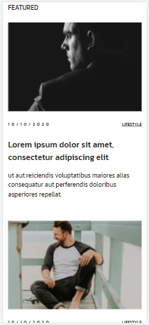

# *Опис*

Цей проєкт реалізований за допомогою препроцесора "SCSS". Для розміщення елементів було використано технологію Flexbox.

Також, в даному проєкті використовуються "медіа-запити" для того, щоб сайт адаптовувався до будь-яких розмірів екрану, що дозволить зручно переглядати контент як на великих екранах, так і на малих.

